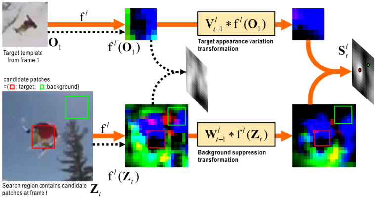
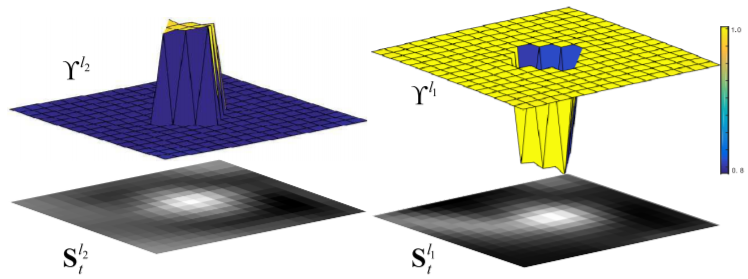
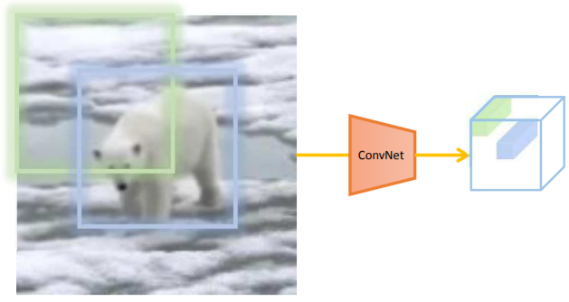
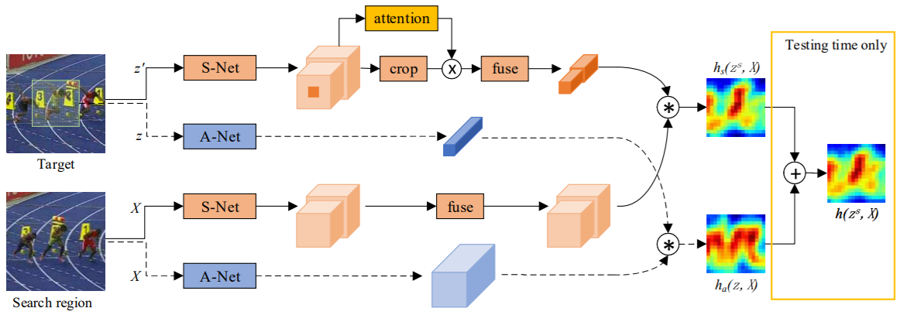
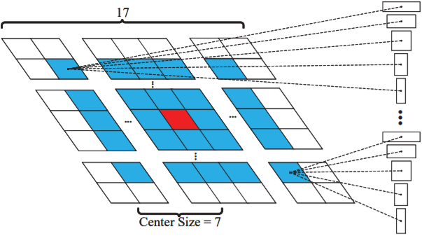
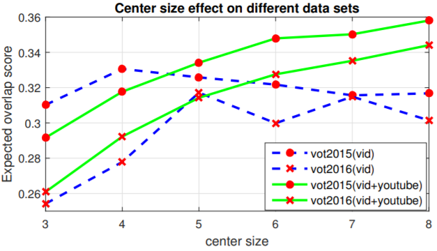
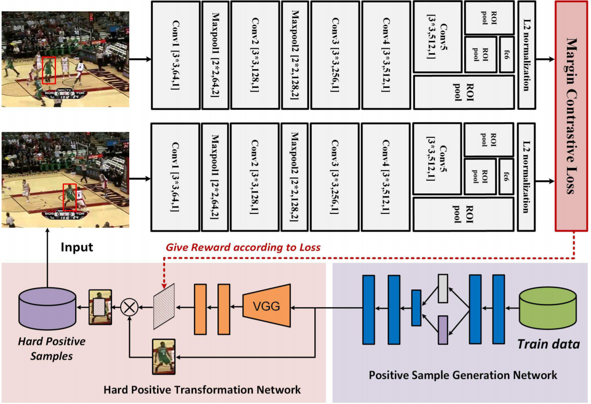
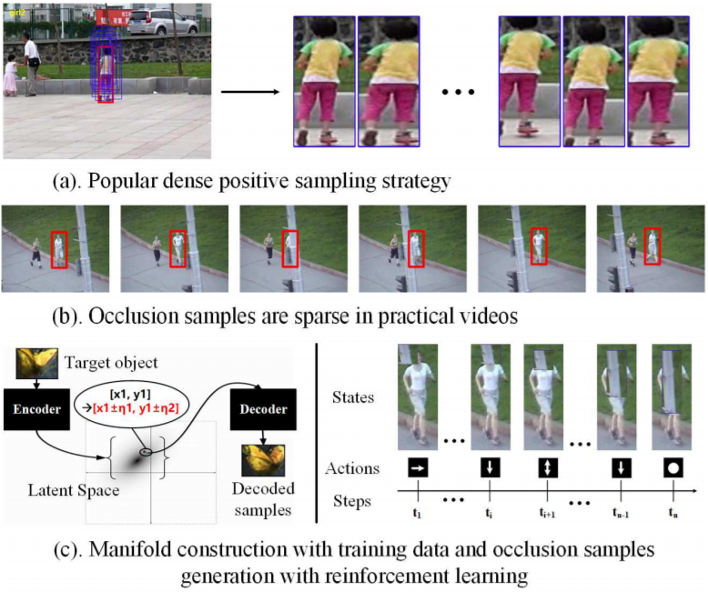
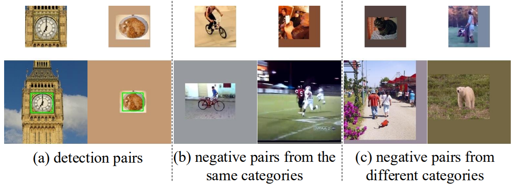

# siamese-tracker-road-trip    基于孪生网络的单目标跟踪论文汇总

## Performance
* Note
    - Ranked by publish time.
    - Performance details are gathered from original papers, not tested under the same platform.
    - OP: meanoverlap precision at the threshold of 0.5.
    - DP/Precision: mean distance precision of 20 pixels.
    - EAO: expected average overlap.

|   Tracker   | Accuracy-VOT2015/2016 | EAO-VOT2015/2016 | EAO-VOT2017 |AUC-CVPR2013 | Precision-CVPR2013 | AUC-OTB100 | Precision-OTB100 | AUC-OTB50 | Precision-OTB50 |  FPS  |
| :---------: |  :---------: | :---------: |       :----------:       |   :----------:      |     :----------------:      |    :--------:    |   :--------------:     |     :-------:      |   :-------------:   | :----: |
|    SINT+    |                 -            |     -            |    -            |       0.655          |             0.882             |          -          |               -               |         -            |            -             |  4     |
|    SINT     |                  -             |     -            |    -            |        0.625       |               0.848            |           -         |               -                |          -          |              -           |   4    |
|SiameseFC-ResNet|     0.5527   |         -            |    -            |      -             |           -                       |         -             |             -                 |          -         |             -           |    25   |
|SiameseFC-AlexNet|     0.5016   |        -            |    0.2      |       -             |           -                       |         -             |             -                 |          -         |             -           |    65   |
|   CFNet-conv1     |            -       |      -            |    -            |      0.578           |           0.714               |         0.536         |          0.658          |      0.488      |       0.613         |    83   |
|   CFNet-conv2     |            -       |     -            |    -            |       0.611           |           0.746               |         0.568         |          0.693          |      0.530      |       0.660         |    75   |
|   CFNet-conv5     |            -       |      -            |    -            |      0.611           |           0.736               |         0.586         |          0.711          |      0.539      |       0.670         |    43   |
|   DSiam     |         0.5414      |        -            |    -            |    0.642           |           0.860               |         -         |          -          |      -      |       -         |    45   |
|   DSiamM     |           0.5566       |      -            |    -            |      0.656           |           0.891               |         -         |          -          |      -      |       -         |    25   |
|   RASNet     |          -       |      0.327        |    0.281     |      0.670           |           0.892               |        0.642      |          -          |      -      |       -         |    83   |
|   SA-Siam     |         0.59       |       0.31        |     0.236     |      0.676           |           0.894               |        0.656      |        0.864        |      0.610    |       0.823      |    50   |
|   SiamRPN     |         0.58/0.56       |       0.358/0.3441        |     0.243     |      -           |           -               |        0.637      |        0.851        |      -    |       -      |    160   |
|    SINT++     |                  -             |     -            |    -            |        -       |               -            |           0.574         |               0.768                |          0.624          |              0.839           |   <4    |
|   DaSiamRPN     |         0.63/0.61       |       0.446/0.411        |     0.326     |      -           |           -               |        0.865(OP)      |        0.88        |      -    |       -      |    160   |

-------

## Trackers

- **2016_CVPR_SINT**
    * **SINT**:R. Tao, E. Gavves, and A. W. Smeulders. Siamese instance search for tracking. In IEEE Conference on Computer Vision and Pattern Recognition, 2016[[paper](http://openaccess.thecvf.com/content_cvpr_2016/papers/Tao_Siamese_Instance_Search_CVPR_2016_paper.pdf)][[code](https://github.com/taotaoorange/SINT)][[project](https://taotaoorange.github.io/projects/SINT/SINT_proj.html)]  

        ##### Contributions
        - Propose to learn a ***generic matching function for tracking***, from external video data, to robustly handle the common appearance variations an object can undergo in video sequences.
        - Present a ***tracker*** based on the learnt generic matching function which reaches state-of-the-art tracking performance.
        - Design a ***two-stream Siamese network*** specifically for tracking to learn the matching function.

        ##### Pipeline
        

        ##### Candidate Sampling
        - Use the ***radius sampling strategy*** to generate candidate boxes. At each sample location, generate three scaled versions of the initial box with the scales being {√2/2, 1,√2}
    - Use Euclidean distance as similarity metric.

        ##### SINT+
        - The ***sampling range*** is adaptive to the image resolution, set to be 30/512 ∗ w in this experiment, where w is the image width.
        - Given the pixels covered by the predicted box in the previous frame and the estimated ***optical flow***, remove the candidate boxes that contain less than 25% of those pixels in the current frame.

-----
- **2016_ECCV_SiameseFC**
    * **SiameseFC:** Luca Bertinetto, Jack Valmadre, João F. Henriques, Andrea Vedaldi, Philip H.S. Torr. "Fully-Convolutional Siamese Networks for Object Tracking." ECCV workshop (2016).[[paper](http://120.52.73.78/arxiv.org/pdf/1606.09549v2.pdf)][[project](http://www.robots.ox.ac.uk/~luca/siamese-fc.html)]
    [[official-code-matlab](https://github.com/bertinetto/siamese-fc)][[code-pytorch](https://github.com/mozhuangb/SiameseFC-pytorch)][[code2-pytorch](https://github.com/GengZ/siameseFC-pytorch-vot)][[code-tensorflow](https://github.com/zzh142857/SiameseFC-tf)]

        ##### Contributions
        - Achieves ***competitive performance*** in modern tracking benchmarks at speeds that ***far exceed the realtime requirement***.
        - Present a novel ***Siamese architecture that is fully-convolutional*** with respect to the search image.

        ##### Pipeline
          

        ##### Method
        - The ***position of the maximum score*** relative to the centre of the score map, multiplied by the ***stride*** of the network, gives the displacement of the target from frame to frame.
        - Function h is ***fully-convolutional*** if:  for integer stride k and any translation .
        - Train: discriminative approach, Logistic loss: , where v is the real-valued score of a single exemplar-candidate pair and y ∈ {+1, −1} is its ground-truth label.  
        - Positive example: within radius R of the centre (accounting for the stride k of the network).
        - Loss for a score map:   
        - ***Multiple scales*** are searched in a single forward-pass by assembling a mini-batch of ***scaled images***(scales 1.03^{−1,0,1}), any change in scale is penalized.
        - ***backbone network***: AlexNet.
        
        - ***elementary temporal constraints***: search area(four times its previous size); a cosine window is added to the score map to penalize large displacements.

-----
- **2017_CVPR_CFNet**
    * **CFNet:** Jack Valmadre, Luca Bertinetto, João F. Henriques, Andrea Vedaldi, Philip H. S. Torr."End-to-end representation learning for Correlation Filter based tracking." CVPR (2017). [[paper](http://openaccess.thecvf.com/content_cvpr_2017/papers/Valmadre_End-To-End_Representation_Learning_CVPR_2017_paper.pdf)][[supp](http://openaccess.thecvf.com/content_cvpr_2017/supplemental/Valmadre_End-To-End_Representation_Learning_2017_CVPR_supplemental.pdf)][[project](http://www.robots.ox.ac.uk/~luca/cfnet.html)][[official-code-matlab](https://github.com/bertinetto/cfnet)]

        ##### Contributions
        - Incorporating the Correlation Filter into the fully-convolutional Siamese framework(SiameseFC).
        - Reveal that adding a Correlation Filter layer does not significantly improve the tracking accuracy.

        ##### Pipeline
          

        ##### Method
        - Establishing an efficient back-propagation map for the solution to a system of circulant equations.
        - Replace  with 

-----
- **2017_ICCV_DSiam**
    * **DSiam:** Qing Guo; Wei Feng; Ce Zhou; Rui Huang; Liang Wan; Song Wang."Learning Dynamic Siamese Network for Visual Object Tracking." ICCV (2017). [[paper](http://openaccess.thecvf.com/content_ICCV_2017/papers/Guo_Learning_Dynamic_Siamese_ICCV_2017_paper.pdf)] [[official-code-matlab](https://github.com/tsingqguo/DSiam)]
        ##### Contributions
        - Propose a fast ***general transformation learning*** model that enables effective online learning of ***target appearance variation*** and ***background suppression*** from previous frames.
        - Propose a ***elementwise multi-layer fusion***, which adaptively integrates the multi-level deep features of DSiam network.
        - Develop a complete ***joint training scheme***, DSiam can be trained as a whole directly on labeled video sequences.

        ##### Pipeline
          
        - Basic pipeline of our DSiam network (orange line) and that of SiamFC(black dashed line).f^l(·) represents a CNN to extract the deep feature at lth layer.  
        - Two transformations are rapidly learned from frame t−1. When the target at frame t (redbox) is entirely different from the template O1, SiamFC gets a meaningless response map, within which no target can be detected

        ##### Method
        
        - Establishing an efficient back-propagation map for the solution to a system of circulant equations.
        - Replace  with 
        -  aims to encourage  being similar to  and is online learned from (t − 1)th frame by considering temporally smooth variation of the target
        -  aims to highlight the deep feature of target neighborhood regions and alleviate the interference of irrelevant background features.
       #####  Elementwise multi-layer fusion
        - Response map for each layer l is , elementwise weight map  and , ***final response map*** , where  denotes the elementwise multiplication.  

        - Two real offline learned fusion weight maps:  
              
            S: response map, layer (l1 = 5, l2=4) from AlexNet. **Note** , the response map of deeper layer l1 has higher weights in periphery and lower weights at central part within the searching region.

------
- **2018_CVPR_RASNet**
    * **RASNet:** Qiang Wang, Zhu Teng, Junliang Xing, Jin Gao, Weiming Hu, Stephen Maybank. "Learning Attentions: Residual Attentional Siamese Network for High Performance Online Visual Tracking." CVPR (2018).[[paper](http://openaccess.thecvf.com/content_cvpr_2018/papers/Wang_Learning_Attentions_Residual_CVPR_2018_paper.pdf)]
        ##### Contributions
        - Different kinds of attention mechanisms are explored within the RASNet: ***General Attention, Residual Attention***, and ***Channel Attention***.
        - Propose an end-to-end deep architecture specifically designed for the object tracking.

        ##### Pipeline
          
        - Weighted cross correlation layer (WXCorr).  
        - Based on the exemplar features, three types of attentions are extracted. Exemplar and search features, along with the attentions as weights are inputed to WXCorr and finally transformed to a response map.

        ##### Method
        - ***Weighted Cross Correlation***: not every constituent provides the same contribution to the cross correlation operation in the Siamese network.the object within the blue rectangular region should be reflected more to the cross correlation operation compared with the green rectangular region.
        
        - Channel Attention: A convolutional ***feature channel*** often corresponds to a certain type of ***visual pattern***.  In certain circumstance some feature channels are more significant than the others.
        - Baseline: SiamFC

-----        
- **2018_CVPR_SA-Siam**
    * **SA-Siam:** Anfeng He, Chong Luo, Xinmei Tian, Wenjun Zeng. "A Twofold Siamese Network for Real-Time Object Tracking." CVPR (2018).[[paper](http://openaccess.thecvf.com/content_cvpr_2018/papers/He_A_Twofold_Siamese_CVPR_2018_paper.pdf)][[project](https://77695.github.io/SA-Siam/)]
        ##### Contributions
        - SA-Siam is composed of a ***semantic*** branch and an ***appearance*** branch, which are trained separately to keep the heterogeneity of the two types of features.
        - Propose a ***channel attention mechanism*** for the semantic branch. Channel-wise weights are computed according to the channel activations around the target position.

        ##### Pipeline
          
        - The network and data structures connected with ***dotted lines*** are exactly the same as SiamFC.
        - ***A-Net***(blue block) indicates the appearance network, which has exactly the same structure as the SiamFC network.
        - ***S-Net***(origin block) indicates the semantic network. The ***channel attention module*** determines the weight for each feature channel based on both target and context information.

        ##### Method
        - ***Symbols***: **z**(the images of target), **z^s**(target with surrounding context, same size as search region), **X**(search region).
        - ***The appearance branch***: 
        response &space;=&space;corr(f_a(z),&space;f_a(X)))
        - ***The semantic branch***: 
        The S-Net is loaded from a pretrained AlexNet on ImageNet, last two convolution layers(***conv4 and conv5***) are used.  
        The concatenated multilevel features(denoted as ***fs*** ). ***Fusion module***, implemented by 1×1 ConvNet. 
        response 
        - ***final response***:
        , 	where ***λ*** is the weighting parameter to balance the importance of the two branches, which can be estimated from a validation set.
        - ***Channel Attention in Semantic Branch***:
          Divide the feature map into 3 × 3 grids, ***Max pooling*** is performed within each grid, and then a ***two-layer multilayer perceptron(MLP)*** is used to produce a coefficient for this channel.  
        Finally, a ***Sigmoid function with bias*** is used to generate the final output weight ξi. 
         
        ***Note***: this module is passed only once for the first frame of a tracking sequence. The computational overhead is negligible.

-----
- **2018_CVPR_SiameseRPN**
    * **SiamRPN:** Bo Li, Wei Wu, Zheng Zhu, Junjie Yan."High Performance Visual Tracking with Siamese Region Proposal Network." CVPR (2018 **Spotlight**).[[paper](http://openaccess.thecvf.com/content_cvpr_2018/papers/Li_High_Performance_Visual_CVPR_2018_paper.pdf)][[code-pytorch](https://github.com/songdejia/Siamese-RPN-pytorch)][[code-pytorch](https://github.com/HelloRicky123/Siamese-RPN)]

        ##### Contributions	
        - propose the ***Siamese region proposal*** network (SiameseRPN) which is end-to-end trained off-line with large-scale image pairs for the tracking task.
        - During online tracking, the proposed framework is formulated as a ***local oneshot detection*** task, which can refine the proposal to discard the expensive multi-scale test.
        - It achieves leading performance in VOT2015, VOT2016 and VOT2017 real-time challenges with the ***speed of 160 FPS***, which proves its advantages in both ***accuracy and efficiency***.

        ##### Pipeline
         
        - ***Left***: Siamese subnetwork for feature extraction
        - ***Middle***: Region proposal subnetwork, which has a ***classification*** branch and a ***regression*** branch. Pair-wise correlation is adopted to obtain the output of two branches.
        - ***Right***: Details of these two output feature maps.
            * In classification branch, the output feature map has ***2k*** channels which corresponding to foreground and background of k anchors.
            * In regression branch, the output feature map has ***4k*** channels which corresponding to four coordinates used for proposal refinement of ***k anchors***.
            * In the figure, ⋆ denotes correlation operator

        ##### Method
        - ***Loss Function***: 
            * For classification(***cross-entropy*** loss), for regression(***smooth L1*** loss), which is same as ***Faster R-CNN***.
            * Regression: Use ***normalized coordinates***, Let Ax, Ay, Aw, Ah denote center point and shape of the anchor boxes and let Tx, Ty, Tw, Th denote those of the ground truth boxes, the normalized distance is: 
            &emsp;&emsp;&emsp; 
            * Smooth L1 loss: 
            &emsp;&emsp;&emsp;&emsp;
            
            * Regression loss: 
            &emsp;&emsp;&emsp; 
            * Final loss: λ is hyper-parameter to balance the two parts. 
            &emsp;&emsp;&emsp; 
        - ***RPN***: 
            * ***Anchor***: Only one scale with different ratios[0.33, 0.5, 1, 2, 3], less than detection task because the same object in two adjacent frames won’t change much.
            * ***Training samples***: Positive(IOU > 0.6) and Negative(IOU < 0.3) 
            At most 16 positive samples and totally 64 samples from one training pair.
        - ***Tracking as one-shot detection***：
            * Because the local detection task is based on the category information only given by the template on initial frame, and the template branches’ outputs are regarded as the ***kernels*** for local detection, so it can be viewed as one-shot detection.
            * ***Proposal selection***: 
                - strategy 1: Discarding the bounding boxes generated by the anchors too far away from the center. 
                
                - strategy 2: Use ***cosine window*** and ***scale change penalty*** to re-rank the proposals’ score to get the best one.
            * ***Non-maximum-suppression***: NMS is performed afterwards to get the final tracking bounding box.
        ##### Discussion
        - ***Anchor ratios***: 3 ratios are tried, [0.5, 1, 2], [0.33, 0.5, 1, 2, 3], [0.25, 0.33, 0.5, 1, 2, 3, 4] (denoted as A3, A5, A7, respectively). 
            * A5 performs better than A3, because it’s easier to predict the shape of target with large ratio of height and width through more anchors.
            * A7's performance drops by ***over-fitting***.

                | ratios |  EAO(without Yuotube) |  EAO(with Yuotube)|
                |:--:   |  :---:  |  :----:|
                |A3 | 0.279 | 0.311|
                |A5  | 0.317 | 0.344|
                |A7 | 0.304 | 0.337|
        - ***Anchor position***:
            * ***Center size*** is related to the size of search region.
            * When the network is trained with Youtube-BB, the performance becomes higher when the center size increases. 
            

---------
- **2018_CVPR_SINT++**
    * **SINT++:** Xiao Wang, Chenglong Li, Bin Luo, Jin Tang. "SINT++: Robust Visual Tracking via Adversarial Positive Instance Generation." CVPR (2018). [[paper](http://openaccess.thecvf.com/content_cvpr_2018/papers/Wang_SINT_Robust_Visual_CVPR_2018_paper.pdf)]

        ##### Contributions	
        - Propose a novel and general ***positive sample generation network(PSGN)*** to bridge the gap between data hunger deep neural networks and visual tracking task.
        - Introduce the ***hard positive transformation network(HPTN)*** which can generate massive hard positive samples.
        - Propose the ***SINT++*** which improves tracking performance of the two streaming Siamese network.

        ##### Pipeline
         
        - ***Three modules***: PSGN, HPTN and two streaming Siamese network.
        - The target object manifold is constructed by ***variational auto-encoder(VAE)*** , and the output can be directly input to the HPTN.
        - The HPTN takes the reconstructed image as input, and learn to occlude the target which become hard for visual tracker to measure via deep reinforcement learning. 

        ##### Method
        - ***PSGN***:  
            * Traditional positive sampling strategy(based on IOU) lacks diversity, thus leading to ***under-fitting***.
            * Utilize the variational autoencoder (VAE) to learn the target object manifold.
        
         
        - ***HPTN***:  
            * ***Create occlusions*** on the target objects using image patch extracted from background.

------
- **2018_ECCV_DaSiamRPN**
    * **DaSiamRPN:** Zheng Zhu, Qiang Wang, Bo Li, Wu Wei, Junjie Yan, Weiming Hu. "Distractor-aware Siamese Networks for Visual Object Tracking." ECCV (2018). [[paper](http://openaccess.thecvf.com/content_ECCV_2018/papers/Zheng_Zhu_Distractor-aware_Siamese_Networks_ECCV_2018_paper.pdf)][[code](https://github.com/foolwood/DaSiamRPN)]

        ##### Contributions	
        - Find that the imbalance of the ***non-semantic*** background and ***semantic distractor*** in the training data is the main obstacle for the learning.
        - Propose a novel Distractor-aware Siamese Region Proposal Networks(DaSiamRPN) framework to learn distractor-aware features in the off-line training, and explicitly suppress distractors during the inference of online tracking.
        - Extend the DaSiamRPN to perform ***long-term*** tracking by introducing a simple yet effective local-to-global search region strategy, which significantly improves the performance of our tracker in ***out-of-view and full occlusion*** challenges.

        ##### Motivation
        - The non-semantic background occupies the majority, while semantic entities and distractor occupy less. This imbalanced distribution makes the training model hard to learn instance-level representation, but tending to learn the differences between foreground and background.
        - Actively generate more semantics pairs in the offline training process.
        - Response comparasion 
        &emsp; 

        ##### Method
        - ***Distractor-aware Training***: 
            * Diverse categories of positive pairs can promote the generalization ability.
            * Semantic negative pairs can improve the discriminative ability.
            * Customizing effective data augmentation for visual tracking.(Except the common ***translation***, ***scale variations*** and ***illumination changes***, introduce ***motion blur***)
            * Training pairs 
            &emsp; 
        
        - ***Distractor-aware Incremental Learning***: 
            * Use ***NMS*** to select the potential distractors *d_i* in each frames. Then collect a distractor set *D := {∀ d_i ∈ D, f(z, d_i) > h ∩ d_i != z_t*}, where *h* is the predefined threshold, *z_t* is the selected target in frame *t* and the number of this set *|D| = n*.
            * Specifically, we get 17x17x5 proposals in each frame at first, and then we use NMS to reduce redundant candidates.
            * The proposal with highest score will be selected as the target zt. For the remaining, the proposals with scores greater than a threshold are selected as distractors. 
            * Introduce a novel distractor-aware objective function to rerank the proposals *P* which have *top-k* similarities with the exemplar.  
            &emsp;&emsp; The weight factor *α^hat* control the influence of the distractor learning, the weight factor *α_i* is used to control the influence for each distractor *d_i*. 
            ***Final selected object***: 
            &emsp; &space;-&space;\frac{\hat{\alpha}\sum_{i=1}^n&space;\alpha_i&space;f(d_i,p_k)}{\sum_{i=1}^n&space;\alpha_i}) 
            ***SiamRPN***: 
            &emsp; })

------
- **2018_ECCV_Siam-BM**
- **2018_ECCV_SiamFC-tri**
- **2018_ECCV_StructSiam**
- **2019_CVPR_CIR**
- **2019_CVPR_C-RPN**
- **2019_CVPR_SiamMask**
- **2019_CVPR_SiamRPN++**

## Survey
* **2017**: R. Pflugfelder. An in-depth analysis of visual tracking with siamese neural networks. arXiv:1707.00569, 2017[[paper](https://arxiv.org/pdf/1707.00569.pdf)]  

## TODO  
- [ ] add road trip figure
- [x] add link for paper&code&project
- [x] add core analyses
- [x] add benchmark comparison
- [ ] finish all paper

## License
MIT